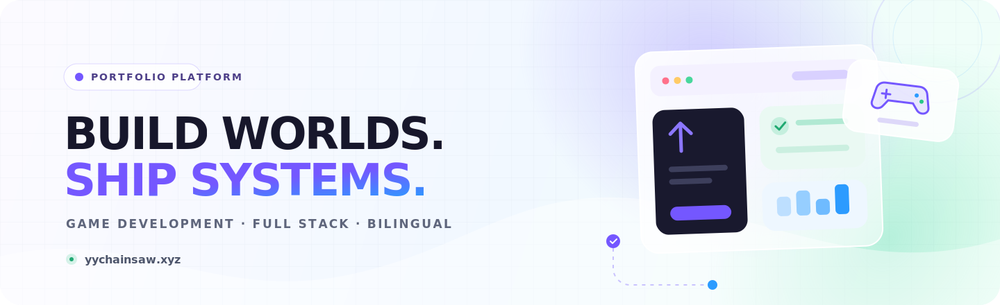
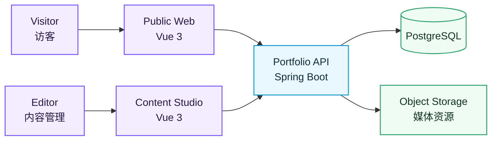

<p align="center">
  
</p>

<p align="center">
  <a href="https://yychainsaw.xyz"><strong>在线访问 / Live Website ↗</strong></a>
  &nbsp;·&nbsp;
  <a href="#01--what-it-is">项目简介</a>
  &nbsp;·&nbsp;
  <a href="#03--tech-radar">技术栈</a>
  &nbsp;·&nbsp;
  <a href="#05--roadmap">路线图</a>
</p>

<p align="center">
  
  
  
  
  
</p>

## 01 · What it is

一个为游戏开发作品而生的中英文内容型作品集。它不只是一张静态名片，而是一套可以持续加入项目、开发记录、媒体素材与技术文章的完整平台。

An extensible, bilingual portfolio platform built to turn game-development experiments into clear, evolving case studies — with a public website, a content studio and a production-ready API in one codebase.

| **Play / 展示** | **Compose / 创作** | **Operate / 管理** | **Evolve / 扩展** |
|---|---|---|---|
| 中英文路由、项目详情、响应式媒体 | 模块化内容、Markdown、媒体资源 | 发布流程、留言、统计、系统状态 | 为 UE 项目、开发日志与新作品预留空间 |
| SEO、结构化数据与可访问性 | 可复用内容区块与项目叙事 | 会话安全、版本记录与审计 | 内容与界面解耦，可持续迭代 |

## 02 · System map



## 03 · Tech radar

| Layer | Technology | Purpose |
|---|---|---|
| Public Web | Vue 3.5 · TypeScript 6 · Vite 8 · Vue Router | 双语站点、项目页面、SEO 与动效体验 |
| Content Studio | Vue 3.5 · Tailwind CSS 4 · Axios · QRCode | 内容、媒体、发布、留言与统计管理 |
| Backend | Java 17 · Spring Boot 3.5 · Spring Security · Spring Session | 内容 API、身份验证、权限与业务编排 |
| Persistence | PostgreSQL 17 · MyBatis-Plus · Flyway | 关系数据、查询与可追踪数据库迁移 |
| Media | Adapter-based object storage | 图片与视频资源的可替换存储适配层 |
| Quality | Vitest · Playwright · JUnit 5 · Testcontainers · axe-core | 单元、集成、端到端与可访问性验证 |
| Tooling | Node.js 22 · Maven 3.9 · Docker · CycloneDX | 可复现构建、环境一致性与 SBOM |

## 04 · Repository

```text
personal-portfolio/
├─ frontend/         # 面向访客的中英文作品集
├─ admin-web/        # 内容管理与发布工作台
├─ backend-parent/   # 模块化 Java / Spring Boot 后端
├─ deploy/           # 环境与发布自动化
└─ docs/             # 设计、实现与维护文档
```

### Local quality checks

```bash
# Public website
cd frontend
npm ci
npm run build
npm run test:unit

# Content studio
cd ../admin-web
npm ci
npm run build
npm run test:unit

# Backend — use mvnw.cmd on Windows
cd ../backend-parent
./mvnw verify
```

准确的运行时与依赖版本以锁文件和 Maven Enforcer 规则为准。生产凭据、私钥、访客数据、数据库备份以及环境专属配置不应进入 Git；仓库仅保留安全的示例与代码。

## 05 · Roadmap

- [x] 中英文公共站点与语言切换
- [x] 可扩展的项目详情与内容模型
- [x] 内容后台、媒体管理与发布流程
- [x] 留言、隐私友好统计与质量保障
- [ ] 补充 UE 学习专题与完整项目复盘
- [ ] 增加开发日志、技术文章与过程素材
- [ ] 展示可下载或可试玩的原型版本
- [ ] 持续优化媒体管线、性能与可访问性

---

<p align="center">
  <sub>Designed for continuous learning, thoughtful storytelling and things still waiting to be built.</sub>
</p>

## License

除非仓库后续提供明确许可证，否则保留全部权利。作品图片、视频、字体及其他第三方素材可能适用各自的许可条款。
