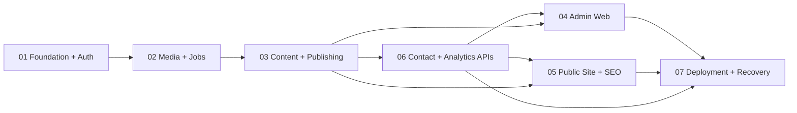

# Full Portfolio Platform Implementation Plan

> **For agentic workers:** REQUIRED SUB-SKILL: Use superpowers:subagent-driven-development (recommended) or superpowers:executing-plans to implement this plan task-by-task. Steps use checkbox (`- [ ]`) syntax for tracking.

**Goal:** Turn 易嘉轩's existing bilingual game-development portfolio into a production-ready public site and single-admin CMS with secure publishing, media, contact, analytics, SEO, Tencent storage, and verified recovery.

**Architecture:** A modular Spring Boot monolith serves admin/public APIs and localized indexable HTML from immutable published revisions. Vue powers the existing public interactions and a separate admin application. PostgreSQL is the sole relational store; LocalStorage/Tencent COS share a provider-neutral media port. BaoTa Nginx serves hash assets/admin and proxies HTML/API to the application. Host timers own backups independently of application availability.

**Tech Stack:** Java 17, Spring Boot 3.5.7, Maven Wrapper 3.9.11, MyBatis-Plus 3.5.7, PostgreSQL 17, Flyway, Spring Security/Session/Thymeleaf, Tencent COS XML SDK 5.6.227; admin Node.js 22.18, Vue 3.5.31, Vue Router 4.6.4, Axios 1.15.1, Tailwind CSS 4.2.2, Vite 8.0.3, TypeScript 6.0.3; public frontend preserves its lockfile versions (currently Vue 3.5.39, Vue Router 5.1.0, Vite 8.1.4, TypeScript 6.0.3); Docker 26, Ubuntu 22.04, BaoTa Nginx.

## Global Constraints

- The approved source of truth is `docs/superpowers/specs/2026-07-14-portfolio-full-backend-design.md`, approved on 2026-07-14.
- The QingLian fitness project is a version/stack reference only. Do not read, connect, copy, migrate, or alter its database or business data.
- Preserve the existing `frontend/` design and motion work. Establish a clean baseline before modifying it; never replace it with a generic portfolio template.
- The product has one administrator, no public accounts, no comments, no public password recovery, and no role system.
- Public content is bilingual `zh-CN` and `en`; required fields in either language block publication.
- Editing a published item changes only the workspace. Public reads use immutable revisions selected by an atomic publication pointer.
- PostgreSQL starts from a new empty database and all structure is created only by Flyway.
- Do not add Redis, a message broker, a second backend service, Elasticsearch, a headless CMS, uploaded video hosting, arbitrary HTML blocks, or public registration.
- Use UUIDs, `timestamptz`, UTC persistence, `Asia/Hong_Kong` reporting days, lowercase snake_case SQL, and package root `xyz.yychainsaw.portfolio`.
- API errors use the shared RFC-7807-style problem shape with `code`, `traceId`, and allowlisted `fieldErrors`; no internal exception, SQL, path, secret, or PII reaches clients.
- Every feature is test-first, every migration is tested from an empty PostgreSQL 17 database, and every task finishes with its focused verification and small commit.
- Do not begin a later phase while an unmet completion gate can invalidate its public contract. Contract-only frontend work may use typed fixtures, but its integration gate remains open until the owner backend phase passes.
- Production cutover for `yychainsaw.xyz` on a mainland-China host remains gated until the final ICP review approves and the ICP number is recorded. Local build, server setup, backup, and private smoke are not blocked.
- Existing user changes and untracked files are never discarded, reset, or silently folded into unrelated commits.

## Approved Product Boundaries

| Area | Approved decision |
|---|---|
| Identity | 易嘉轩; game development; learning Unreal Engine; Jiangxi Normal University, entering junior year |
| Public experience | Bright, clean, responsive bilingual portfolio with language switch at top right and room for future projects |
| Content model | Markdown plus ordered typed blocks; no arbitrary stored HTML |
| Publishing | Draft workspace, validation, preview, immutable revision, atomic pointer, history, restore-to-new-draft |
| Media | JPEG/PNG/PDF; private originals; responsive variants; Local and Tencent COS can coexist |
| Contact | Public form, private admin inbox, durable email notification, one-year default retention |
| Analytics | First-party opt-in, DNT-aware, no IP storage, 30-day raw events, persistent daily aggregates |
| Authentication | Password + TOTP + one-use recovery codes, server sessions, CSRF, local bootstrap/recovery CLI |
| Deployment | Tencent Lighthouse Ubuntu 22.04, Docker 26, BaoTa Nginx/TLS, `yychainsaw.xyz` |
| Recovery | RPO 24 hours, RTO 4 hours, independent encrypted database and media backups, quarterly drill |

## Plan Set and Ownership

| Plan | Primary ownership | Migration ownership | Required before full integration |
|---|---|---|---|
| [01 Foundation and Auth](2026-07-14-portfolio-01-foundation-auth.md) | repository baseline, Maven, PostgreSQL, common API, security, audit, CLI | V1–V2 | none |
| [02 Media and Storage](2026-07-14-portfolio-02-media-storage.md) | Local/COS, upload validation, variants, durable jobs, media admin API | V3 | 01 |
| [03 Content and Publishing](2026-07-14-portfolio-03-content-publishing.md) | normalized workspace, import, revisions, preview, public API/HTML/SEO contracts | V4–V5 | 01–02 |
| [04 Admin Web](2026-07-14-portfolio-04-admin-web.md) | auth UI, CMS editors, media, publishing, inbox, analytics, operations | none | 01–03 and 06 APIs |
| [05 Public Site and SEO](2026-07-14-portfolio-05-public-site-seo.md) | existing-site data integration, detail/privacy/404, contact, consent, accessibility | none | 03 and 06 APIs |
| [06 Contact and Analytics](2026-07-14-portfolio-06-contact-analytics.md) | contact/outbox/inbox, privacy analytics, aggregation/report APIs | V6–V7 | 01–03 |
| [07 Deployment and Recovery](2026-07-14-portfolio-07-deployment-recovery.md) | reproducible release, Compose/Nginx, ICP gate, rollback, backup, restore | none | all product phases |

Plan numbers group artifacts by product surface. Recommended execution follows the dependency graph below: 01 → 02 → 03 → 06; then 04 and 05 may run in parallel; 07 follows both. This order prevents the admin/public applications from inventing backend contracts.



## Cross-Plan Contract Registry

These names are integration contracts, not suggestions. A phase changing one must update every consumer and its contract test in the same commit.

### Foundation contracts

```java
package xyz.yychainsaw.portfolio.audit;
public interface AuditService {
    void record(AuditCommand command);
}

package xyz.yychainsaw.portfolio.auth;
public interface CurrentAdminProvider {
    UUID requireAdminId();
}

package xyz.yychainsaw.portfolio.common.error;
public class DomainException extends RuntimeException {
    public DomainException(String code, HttpStatus status, Map<String, String> fieldErrors);
}

package xyz.yychainsaw.portfolio.common.ratelimit;
public interface RateLimiter {
    RateLimitDecision consume(String policy, String subject);
}
public record RateLimitDecision(boolean allowed, long retryAfterSeconds) {}
```

- Every PostgreSQL integration test that boots Spring extends `xyz.yychainsaw.portfolio.support.PostgresIntegrationTestBase`; Flyway connects as `portfolio_migrator`, while the application datasource connects as `portfolio_runtime`.
- The four bounded limiter policy names are exact: `admin-login`, `admin-security`, `public-contact`, and `public-events`.
- `GET /api/admin/auth/csrf` is the sole anonymous, same-origin, `no-store` CSRF bootstrap. Both admin mutations and public `contact`/`events` POSTs use its returned header/token; public endpoints are not exempt.
- Admin session rows use `SessionView(UUID id, AdminSessionStatus status, Instant createdAt, Instant endedAt, long lastAccessMillis, String clientSummary, String reason, boolean current)`.
- TOTP key rotation keeps old and new keys during a backup-gated offline `--portfolio.cli.command=totp-reencrypt` run; the seed is unchanged, plaintext bytes are wiped, and old keys are removed only after login proof.

### Media/job contracts

- `StorageService` provides provider identity, put, open, signed GET, existence, copy, and delete; `StorageRouter` selects by each asset's persisted provider.
- `BackgroundJobService` provides idempotent enqueue, lease, success, and retry/failure; `JobHandler` identifies and handles one bounded job type.
- Public media access requires the current published revision to reference the asset; draft, historical-only, archived, and random UUID requests return `404`.
- Admin preview media is authenticated and separate from the public media authorization path.
- Localized media copy is exactly `MediaCopyDescriptor(String alt, String caption, String credit, String sourceUrl)` through workspace, revision, public DTO, and both Vue consumers.
- Physical media deletion and backup share PostgreSQL advisory keys `(1347375700, 1296385097)`: deletion holds the exclusive session lock across provider I/O; backup holds the shared session lock until its closed media set is verified remotely.

### Content/public contracts

- Locales are exactly `zh-CN` and `en`; slugs are shared ASCII identifiers across locales.
- Public API responses use `PublishedEnvelope<T> = { revisionVersion, checksum, data }`.
- Public catalog `data` is `ProjectCard[]`; project details use the plan-03 typed content-block union.
- Server HTML serializes one escaped `PageBootstrap` in `<template id="__PORTFOLIO_DATA__">`; `kind` is `home`, `project`, or `privacy`.
- `frontend/dist/.vite/manifest.json` is copied into the Spring image at classpath `/public-assets/.vite/manifest.json`.
- `PORTFOLIO_RELEASE_ID` combines Git commit and the matching manifest hash for HTML ETag invalidation.
- `CurrentPublicationQuery` is the only cross-module way for analytics/media to validate current public project/revision visibility.
- Public media is `PublicMediaDto(UUID assetId, String variant, String src, String srcset, String alt, String caption, String credit, String sourceUrl, int width, int height)`; attribution fields are never silently dropped.

### Contact/analytics contracts

```text
POST   /api/public/contact
POST   /api/public/events
GET    /api/admin/messages
GET    /api/admin/messages/{id}
PATCH  /api/admin/messages/{id}/status
POST   /api/admin/messages/{id}/email/retry
DELETE /api/admin/messages/{id}
GET    /api/admin/analytics/summary
GET    /api/admin/analytics/timeseries
GET    /api/admin/analytics/breakdown
GET    /api/admin/system/operations
```

- Contact public responses reveal only generic acceptance.
- Analytics reports expose aggregate counts and definitions, never raw events or HMAC identity keys.
- The browser never creates identifiers or sends events without consent; `DNT=1` suppresses both prompt and collection.
- Admin message details expose `EmailDeliveryView(String status, int attempts, Instant nextAttemptAt, Instant sentAt, Instant updatedAt, String errorCategory)`; `errorCategory` is sanitized and never carries an SMTP response or recipient.

### Release contracts

- `npm --prefix frontend run build` → `frontend/dist`, including `.vite/manifest.json` and `assets/*`.
- `npm --prefix admin-web run build` → `admin-web/dist`, with base `/admin/`.
- Each release retains its public manifest/assets and admin directory for traceability.
- Deployment copies hash assets create-only to shared `/opt/portfolio/assets`; Nginx `/assets/` always points there.
- `/opt/portfolio/current-admin` atomically points to the selected release's admin directory.
- Production Compose has only `portfolio-api` and `postgres`; host Nginx proxies API/HTML to `127.0.0.1:18080`.
- Release acceptance verifies the API image/JAR, PostgreSQL 17 image archive, public/admin/operations trees, bundle payload, and recorded source-continuity tag rather than trusting `releaseId` alone.
- A backup reads LOCAL and COS provider rows from one exported MVCC snapshot, stores COS bytes as immutable `blobs/{sha256}` plus self-contained set manifests, stores each LOCAL set as an encrypted tar, and prunes a blob only when no retained set references it.
- Restore drills include current publications plus explicitly selected historical revisions, restore mixed providers to isolated targets, and prove bytes through real Nginx/API GETs before a redacted drill result is written back.

## Database Migration Ledger

| Version | Owner | Required tables/concerns |
|---|---|---|
| V1 | 01 | `portfolio` schema, shared timestamp trigger/function, grants and core prerequisites |
| V2 | 01 | official Spring Session tables, admin identity, TOTP/recovery, durable session metadata, immutable audit |
| V3 | 02 | media assets/translations/variants, background jobs, maintenance runs |
| V4 | 03 | normalized site/project workspace, translations, typed blocks, redirects/import state |
| V5 | 03 | publications, immutable revisions, catalog, revision media references, constraints/triggers |
| V6 | 06 | contact messages and dedicated email outbox |
| V7 | 06 | raw privacy analytics and daily aggregates |

No other phase creates a migration in this implementation set. If implementation discovers a schema correction after its owner migration has been merged or applied outside a disposable database, add the next forward migration; never edit applied history.

---

### Task 1: Establish a protected baseline and execute Plan 01

**Files:**
- Execute: `docs/superpowers/plans/2026-07-14-portfolio-01-foundation-auth.md`
- Preserve: `frontend/**`

- [ ] Inventory the untracked existing frontend, run its current checks, and commit a baseline without changing design/content.
- [ ] Execute every Plan-01 checkbox in order using red-green-refactor.
- [ ] Confirm empty PostgreSQL 17 applies V1/V2 only through Flyway.
- [ ] Confirm the unique admin bootstrap, password/TOTP login, recovery codes, session rotation/revocation, CSRF, rate limiting, audit, and local recovery CLI gates.
- [ ] Run Plan 01's complete phase command and record its passing output/commit SHA in the implementation log.

Expected: a runnable backend foundation with no business-content or media tables beyond its owned migrations.

---

### Task 2: Execute Plan 02 and freeze storage/job contracts

**Files:**
- Execute: `docs/superpowers/plans/2026-07-14-portfolio-02-media-storage.md`

- [ ] Execute every Plan-02 checkbox after Plan 01 passes.
- [ ] Confirm Local and COS adapters pass the same storage contract without exposing credentials.
- [ ] Confirm upload validation, staging/finalization, immutable originals, responsive variants, retry/dead-job behavior, and preview authorization.
- [ ] Confirm provider changes affect only new assets and Local/COS rows remain readable together.
- [ ] Run the optional real-COS disposable-prefix smoke only with short-lived credentials, then verify cleanup.
- [ ] Freeze `StorageService`, `BackgroundJobService`, `JobHandler`, and media-reference contracts before Plan 03.

Expected: V3 and media endpoints are complete; no public UUID can bypass publication visibility.

---

### Task 3: Execute Plan 03 and freeze publishing/public DTOs

**Files:**
- Execute: `docs/superpowers/plans/2026-07-14-portfolio-03-content-publishing.md`

- [ ] Execute every Plan-03 checkbox after Plans 01–02 pass.
- [ ] Run deterministic Vite export and transactional import against the existing portfolio; compare every mapped field and fixed warning.
- [ ] Confirm workspace edits do not affect public reads, both locales are required, mixed blocks are sanitized, and catalog compare-and-swap rejects lost updates.
- [ ] Confirm project publish changes PROJECT and PROJECT_CATALOG pointers in one transaction.
- [ ] Confirm revision restore creates a new draft and never edits immutable history.
- [ ] Confirm localized HTML/API, bootstrap envelope, ETags, sitemap, canonical/hreflang/OG/JSON-LD, old-slug redirect, and public media authorization.
- [ ] Generate or validate the shared TypeScript DTOs used by Plans 04–05 and freeze the registry contracts.

Expected: V4/V5, admin content APIs, preview, publish/history/restore, and source-backed public DTO/HTML contracts all pass.

---

### Task 4: Execute Plan 06 before building its UI consumers

**Files:**
- Execute: `docs/superpowers/plans/2026-07-14-portfolio-06-contact-analytics.md`

- [ ] Execute all server/schema tasks in Plan 06 after Plan 03 passes.
- [ ] Confirm contact + outbox transaction, SMTP lease/retry/dead state, admin inbox/versioning/deletion, and one-year retention.
- [ ] Confirm no-consent and DNT requests persist no event, raw identity fields do not exist, ten-second dedupe is concurrency-safe, and raw retention is 30 days.
- [ ] Confirm fixed Hong Kong fixtures reproduce PV, summed daily UV, referrals, project views, downloads, clicks, and data-delay definitions.
- [ ] Freeze message, analytics, and operations API DTOs before Plans 04–05 consume them.
- [ ] Defer only browser Playwright assertions to the owning UI plans; all server integration tests must already pass.

Expected: V6/V7 and every public/admin contact/analytics API are stable and privacy-tested.

---

### Task 5: Execute Plans 04 and 05 in parallel, then integrate

**Files:**
- Execute: `docs/superpowers/plans/2026-07-14-portfolio-04-admin-web.md`
- Execute: `docs/superpowers/plans/2026-07-14-portfolio-05-public-site-seo.md`

- [ ] Spawn one isolated implementation worker per plan only after Plans 03 and 06 freeze DTOs; coordinate edits to shared root configuration before applying them.
- [ ] Plan 04 builds `admin-web` authentication, dashboard, content/block editors, media, publishing/history, inbox, analytics, security/session, audit, and operation views.
- [ ] Plan 05 adapts the existing public site to published bootstraps, keeps the approved bright/minimal design, adds project/privacy/404 routes, contact, opt-in analytics, SEO, accessibility, and reduced motion.
- [ ] Run unit/type/build checks independently for both applications.
- [ ] Run integrated Playwright journeys against the real backend: login/TOTP; bilingual edit/preview/publish; public locale/detail/old slug; contact/email failure/retry; consent/DNT analytics; mobile keyboard/focus/reduced motion.
- [ ] Confirm public/admin builds emit their exact release-contract directories and no plan has redefined the plan-03 DTOs.

Expected: the complete browser product works against the real backend with no mocked API remaining in production code.

---

### Task 6: Execute Plan 07 and prove the production/recovery boundary

**Files:**
- Execute: `docs/superpowers/plans/2026-07-14-portfolio-07-deployment-recovery.md`

- [ ] Execute release build, Compose, Nginx, deployment, rollback, backup, operations-status, restore-drill, and runbook tasks.
- [ ] Confirm one release ID binds Git commit, public manifest, static files, admin files, and Spring image.
- [ ] Confirm PostgreSQL is private, API is loopback-only, Nginx forwarding/security/fallback rules pass, and old hash assets survive switch/rollback.
- [ ] Confirm deployment creates a verified recovery point before Flyway and rollback never runs a down migration.
- [ ] Confirm encrypted database and independent media bytes upload with 7 daily/4 weekly/6 monthly retention and off-server key custody.
- [ ] Complete one isolated restore proving current content, media, login, and an historical-revision restore within RPO 24h/RTO 4h.
- [ ] Keep `PUBLIC_DOMAIN_ENABLED=false` while ICP remains under final review; perform the public-domain gate only after approval and number recording.

Expected: the platform is production-ready even if public DNS cutover is waiting on ICP approval.

---

### Task 7: Run the system-wide acceptance and security gate

**Files:**
- Verify: all production/test/config/documentation files created by Plans 01–07.
- Create during implementation: `docs/operations/release-evidence-template.md` as required by Plan 07.

- [ ] Start from an empty PostgreSQL 17 volume and apply V1–V7; verify Flyway is the only schema creator.
- [ ] Run the full Maven `verify`, both frontend test/type/build suites, all Playwright journeys, storage contracts, cache matrix, HTML contracts, and script contracts.
- [ ] Inspect the final database schema for forbidden secret/IP/raw-identity columns and the artifact tree for accidental credentials.
- [ ] Verify public content is exclusively current-published data, draft/history media is not public, and restoring a revision creates a new draft.
- [ ] Verify sessions, TOTP/recovery, CSRF, rate limits, proxy trust, CSP, MIME, PDF disposition, structured error redaction, and local-only health.
- [ ] Verify no plaintext secret/backup exists in Git, Docker history, release JSON, Nginx rendering, logs, or backup manifests.
- [ ] Record exact command output, release ID, migration versions, image digests, backup checksums, smoke matrix, ICP gate state, RPO, and RTO in release evidence.
- [ ] Request an independent code/security review and resolve every blocking finding before declaring the implementation complete.

Expected: every acceptance criterion in the approved design has evidence or an explicitly gated external condition; the only permitted external gate is mainland public-domain cutover while ICP approval is pending.

---

## Definition of Done

- [ ] All seven phase plans have every checkbox completed or an approved scope change recorded in the design.
- [ ] V1–V7 build the complete schema from empty PostgreSQL 17 with no manual SQL.
- [ ] The existing public visual identity remains intact while content, bilingual routes, project expansion, accessibility, and SEO are backend-driven.
- [ ] One administrator can securely bootstrap, log in with TOTP, manage/revoke sessions, recover locally, edit/preview/publish/restore, manage media, read messages, and view defined analytics.
- [ ] Visitors can browse indexable Chinese/English content, projects, media, privacy, and contact without an account or analytics consent.
- [ ] Failed email never loses a message; analytics never stores IP/full UA/raw browser ID; retention tasks are proven.
- [ ] Local/COS coexistence, atomic publication, cache invalidation, slug redirects, public-media checks, and concurrency cases pass real PostgreSQL tests.
- [ ] One reproducible release deploys and rolls back safely behind BaoTa Nginx.
- [ ] Independent encrypted database/media backups and a full isolated restore meet RPO 24h/RTO 4h.
- [ ] ICP final-review status is represented accurately; mainland DNS/domain cutover waits for approval and number, while all other readiness work can finish.
