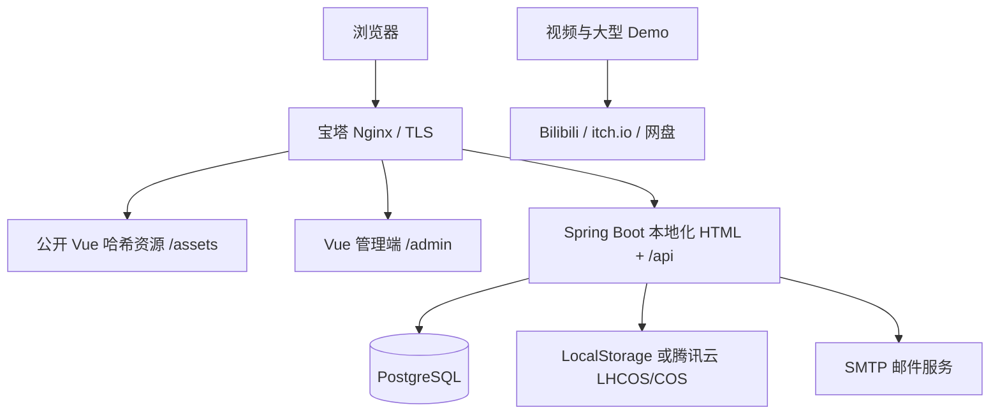
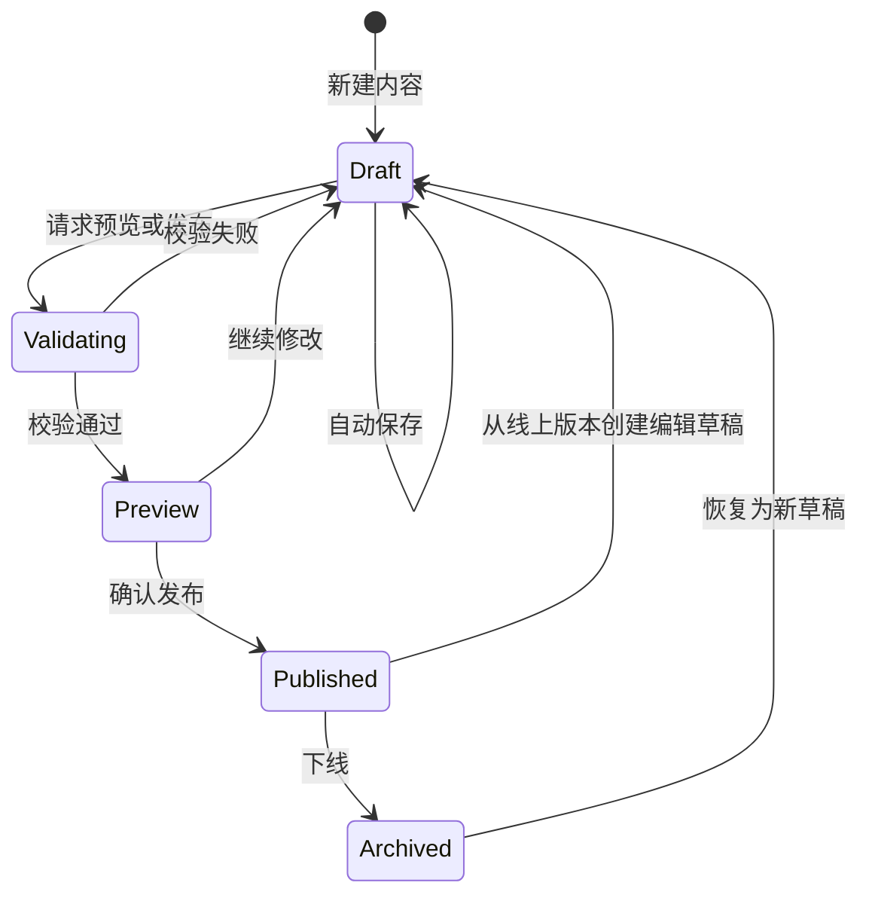

# 个人作品集完整后台设计

日期：2026-07-14
状态：已批准（2026-07-14）

## 1. 背景

现有项目是一个位于 `frontend/` 的 Vue 3 双语个人作品集，内容目前编译在前端 TypeScript 文件中。目标是在不重做现有公开视觉设计的前提下，增加一套完整、可维护、适合个人使用和后端能力展示的内容管理后台。

参考项目 `QingLian-MyFitnessApp-Android-SpringBoot` 只用于确认熟悉的技术栈与版本。作品集不连接、不读取、不迁移该项目的数据库、业务表或业务数据，也不复制其中的鉴权、安全与部署实现。

## 2. 目标

- 提供位于 `/admin` 的单管理员内容管理后台。
- 管理首页、个人资料、项目、技能、标签、路线图、媒体、简历与 SEO。
- 同时维护 `zh-CN` 和 `en`，两种语言完整后才能发布。
- 项目详情同时支持 Markdown 和可排序内容块。
- 已发布内容再次编辑时不影响线上版本。
- 支持预览、原子发布、版本历史与从旧版本恢复。
- 支持腾讯云轻量对象存储或 COS，并保留本地磁盘适配器。
- 支持访客留言、后台收件箱与邮件提醒。
- 支持隐私友好的轻量访问统计。
- 使用 TOTP、服务端会话、审计日志和完整安全边界保护后台。
- 支持 Ubuntu 22.04、Docker 26、宝塔 Nginx 的部署、备份与回滚。

## 3. 非目标

- 不提供公众注册、登录、评论、点赞、收藏或用户社区。
- 不提供多租户、复杂 RBAC、内容审批流或通用低代码页面搭建器。
- 一期不引入 Redis、消息队列、Elasticsearch、Kubernetes或微服务。
- 不在轻量服务器或对象存储中直接托管高码率视频和大型 UE Demo；此类内容使用 Bilibili、itch.io 或网盘。
- 不复用青炼项目的 MD5、硬编码 JWT、自制登录拦截器、宽松 CORS、Fastjson 1.x 或现有数据库。
- 一期不增加独立的经历、友情链接、博客、评论或结构化在线简历编辑器；教育经历继续作为个人资料事实展示，简历只管理中英文 PDF。后续可以在不改变发布模型的前提下增加新聚合。

## 4. 总体架构

采用模块化单体架构：一个 Spring Boot 应用进程承载认证、内容、发布、媒体、留言、统计和审计模块；各模块通过明确的 Service 接口协作，共享一个 PostgreSQL 数据库，但不跨模块直接访问内部实现。



生产边界：

- 宝塔在宿主机管理公网 80/443、TLS、Nginx、压缩、缓存和静态文件。
- Docker Compose 管理 `portfolio-api` 和 PostgreSQL，不运行第二套公网 Nginx。
- API 仅绑定 `127.0.0.1:18080`。
- PostgreSQL 只加入 Docker 私有网络，不映射公网端口。
- 公开 API 位于 `/api/public/*`，管理 API 位于 `/api/admin/*`。
- `/`、`/zh-CN`、`/en`、本地化项目页和隐私页由 Spring Boot 根据发布快照输出 HTML；带 hash 的 Vue 资源仍由 Nginx 静态提供。
- 管理端和 API 同源，使用安全 Cookie 与 CSRF 防护。

## 5. 仓库和工程结构

```text
personal-portfolio/
├── frontend/                    现有公开作品集
├── admin-web/                   Vue + TypeScript 管理端
├── backend-parent/
│   ├── pom.xml                  Maven 父工程与版本管理
│   ├── portfolio-pojo/          API DTO、VO 与共享校验契约
│   ├── portfolio-common/        错误码、通用响应、受控基础工具
│   └── portfolio-server/        Spring Boot 应用
│       └── src/main/java/.../
│           ├── auth/
│           ├── content/
│           ├── publishing/
│           ├── media/
│           ├── message/
│           ├── analytics/
│           ├── audit/
│           └── system/
├── deploy/                      Compose、Nginx 示例和部署脚本
└── docs/                        架构、API、数据库和部署文档
```

`portfolio-server` 采用按功能分包。每个功能包内部放置自己的 Controller、Service、持久化实体、Mapper、转换器与测试，避免形成全局的大型 Controller、Service 和 Mapper 目录。`portfolio-pojo` 只保留跨边界 API 契约和共享校验，不集中放置全部数据库实体；`portfolio-common` 只承载错误模型、追踪和无业务含义的基础设施，不允许成为业务逻辑杂物箱。三个 Maven 模块是构建边界，领域边界仍以 `portfolio-server` 的功能包为准。

## 6. 功能模块

### 6.1 管理端

- 仪表盘：草稿数、已发布项目、未读留言、最近访问趋势与最近操作。
- 站点内容：个人身份、Hero、About、Contact、导航、页脚与社交链接。
- 项目：列表、排序、精选、状态、双语内容、标签、技能、媒体和 SEO。
- 混合编辑器：统一的可排序块列表；Markdown 本身是一种块，可与图片、图集、外部视频、代码、引用、数据指标、下载和外链块任意组合。
- 路线图：阶段、周期、摘要、成果项、排序和可见性。
- 媒体库：图片、PDF、文件元数据、双语 alt/caption、版权来源和引用关系。
- 发布中心：翻译完成度、预览、发布记录、历史版本和恢复。
- 留言收件箱：未读、已读、归档、垃圾信息、删除和邮件状态。
- 访问统计：PV、匿名 UV、来源、热门项目、下载和外链点击。
- 设置：SEO、简历、存储状态、管理员安全、会话和审计日志。

### 6.2 后端

- `auth`：管理员、密码、TOTP、恢复码、会话、限流与 CSRF。
- `content`：站点资料、项目、标签、技能、路线图与双语工作数据。
- `publishing`：发布校验、预览、不可变快照、发布指针、恢复与 slug 重定向。
- `media`：上传校验、对象存储适配、元数据、引用关系和删除保护。
- `message`：访客留言、收件箱、反垃圾和邮件 Outbox。
- `analytics`：事件接收、去重、机器人过滤、每日聚合与查询。
- `audit`：安全和内容管理关键操作的不可变日志。
- `system`：健康检查、运行配置、维护任务和备份状态。

### 6.3 公开站接入

- 新增 `services/portfolioApi` 和 DTO 映射层，页面组件不直接散落网络请求。
- 首页从 `SITE` 与 `PROJECT_CATALOG` 已发布快照渲染，项目详情从 `PROJECT` 已发布快照渲染；`portfolio.ts` 只作为首次导入源，切换后不再作为第二套运行时真相。
- 公开 URL 使用 `/zh-CN`、`/en`、`/{locale}/projects/{slug}`、`/{locale}/privacy`；右上角语言切换保持同一页面语义并切换 locale 路径。
- 新增项目详情和 404 路由；Nginx 对前端路由提供明确回退，不把未知 `/api` 请求回退到 HTML。
- 异步内容必须提供加载、空数据、错误与重试状态。现有 reveal 动画改为在异步节点插入后重新观察，避免后加载项目永久保持透明。
- 服务端 HTML 外壳嵌入当前已发布快照的初始 JSON，Vue 首次挂载复用该数据，避免首屏再次请求时读到另一个版本。

## 7. 数据库设计

数据库使用全新的 PostgreSQL Schema。主键统一使用 UUID，时间统一使用 `timestamptz` 并按 UTC 保存。翻译表使用 `(parent_id, locale)` 联合唯一约束，`locale` 只允许 `zh-CN` 和 `en`。

### 7.1 认证与审计

- `admin_user`：账号、密码哈希、状态、TOTP 加密密文、最后登录时间和乐观锁版本。
- `spring_session`、`spring_session_attributes`：由 Spring Session JDBC 运行、但只由 Flyway 建表的服务端会话数据；配置 `spring.session.jdbc.initialize-schema=never`，禁止框架再次自动建表，并用 `Scheduled.CRON_DISABLED` 关闭框架默认删除任务。
- `admin_session_metadata`：以自身 UUID 为主键，通过可空、唯一 FK 关联不会随 `changeSessionId` 旋转的 `spring_session.PRIMARY_ID`，`ON DELETE SET NULL`；保存管理员、ACTIVE/REVOKED/EXPIRED 状态、创建/最后活动/结束时间、脱敏客户端摘要和撤销原因，不保存原始 IP 或完整 User-Agent。活动会话的最后访问时间从 `spring_session` 读取；安全过滤器只接受 ACTIVE metadata。手动撤销先把 metadata 标成 REVOKED 使会话立即失效，再删除 session；删除失败由任务重试。自有定时任务先标记过期记录为 EXPIRED 再删除 session，历史元数据因此保留。表结构与清理定制以 [Spring Session JDBC 官方说明](https://docs.spring.io/spring-session/reference/configuration/jdbc.html)为准。
- `totp_recovery_code`：一次性恢复码哈希和使用时间。
- `audit_log`：操作者、操作类型、目标、结果、traceId、必要元数据和时间。

### 7.2 内容工作区

- `site_profile`、`site_profile_translation`
- `site_seo_translation`
- `site_accessibility_copy_translation`
- `site_navigation_item`、`site_navigation_item_translation`
- `hero_section`、`hero_section_translation`、`hero_media`
- `about_section_translation`
- `work_section_translation`
- `contact_section_translation`
- `privacy_notice_translation`
- `social_link`
- `profile_fact`、`profile_fact_translation`
- `profile_skill`、`profile_skill_translation`
- `project`、`project_translation`
- `project_content_block`、`project_content_block_translation`
- `content_block_media`
- `content_block_markdown_translation`
- `content_block_video`
- `content_block_code`
- `content_block_quote_translation`
- `content_block_action`
- `content_block_metric`、`content_block_metric_translation`
- `tag`、`tag_translation`
- `skill`、`skill_translation`
- `project_tag`、`project_skill`
- `roadmap_header_translation`
- `roadmap_stage`、`roadmap_stage_translation`
- `roadmap_outcome`、`roadmap_outcome_translation`
- `resume_document`

工作区表表示当前可编辑草稿。语言无关的排序、状态、日期和关联放主表；标题、摘要、正文、alt、caption 和 SEO 文案放翻译表。`resume_document` 包含 locale、`media_asset_id`、版本标签、当前生效标志和发布时间；启用简历入口时，每个 locale 必须且只能有一个当前 PDF。

#### 7.2.1 现有内容映射

首次导入器按下面的固定映射读取当前 `portfolio.ts`，不使用通用 EAV 或任意页面搭建数据：

| 当前内容 | 工作区目标 | 必填与规则 | 发布聚合 |
|---|---|---|---|
| `identity.monogram/nameZh/nameEn/email` | `site_profile`、`site_profile_translation` | 名称与邮箱必填；邮箱不按 locale 重复 | `SITE` |
| `seo.title/description` | `site_seo_translation` | 两种语言均必填 | `SITE` |
| `a11y.*` | `site_accessibility_copy_translation` 的固定字段 | 现有 8 个键两种语言均必填 | `SITE` |
| `nav.*` | `site_navigation_item` 及翻译 | 目标锚点固定、标签双语、顺序可调 | `SITE` |
| `hero.*` | `hero_section` 及翻译 | CTA、可用状态和标题双语必填 | `SITE` |
| `heroAsset` | `hero_media` → `media_asset` | 原图、焦点、署名、来源和双语 alt 必填 | `SITE` |
| `about.*` | `about_section_translation` | 标题、陈述和焦点文案双语必填 | `SITE` |
| `about.facts[]` | `profile_fact` 及翻译 | 稳定 ID、排序、label/value 双语 | `SITE` |
| `about.skills[]` | `profile_skill` 及翻译 | name/status 双语并可排序 | `SITE` |
| `work.*` | `work_section_translation` | 区块标题、介绍、图片提示和拓展位文案双语 | `SITE` |
| `projects[]` | `project`、`project_translation`、`project_tag` | `id` 作为导入外部键；number/status/eyebrow/title/summary/tags 完整映射 | `PROJECT`、`PROJECT_CATALOG` |
| `projectAssets[]` | `project_media` → `media_asset` | 必须与项目 ID 一一匹配；layout、焦点、署名、来源、双语 alt 完整映射 | `PROJECT`、`PROJECT_CATALOG` |
| `roadmap` 头部 | `roadmap_header_translation` | label/title/introduction 双语必填 | `SITE` |
| `roadmap.stages/outcomes` | `roadmap_stage`、`roadmap_outcome` 及翻译 | number/period/title/summary/outcomes 双语并保持排序 | `SITE` |
| `contact.*`、`footerNote` | `contact_section_translation` 与 `site_profile.email` | CTA、说明、邮箱标签和页脚双语；邮箱单一来源 | `SITE` |

Java 不解析或执行 TypeScript。唯一导入链路是 `frontend/scripts/export-portfolio.mjs` 使用当前已锁定的 [Vite JavaScript API](https://vite.dev/guide/api-javascript.html) `ssrLoadModule('/src/data/portfolio.ts')`，只提取 `identity`、`heroAsset`、`projectAssets` 和 `portfolioContent`，固定对象键顺序但保留所有业务数组顺序，输出 `schemaVersion=1` 的规范 JSON 到被 Git 忽略的 `runtime/import/portfolio-v1.json`。Node 端先按 `portfolio-import-v1.schema.json` 校验，Java CLI 再反序列化为有类型的 `PortfolioImportV1` 并复核 schema version、JSON SHA-256；媒体路径只允许在显式 `--asset-root frontend/public` 下解析并拒绝路径穿越。

导入先做 dry-run，区分结构错误和发布就绪警告。缺失/重复 ID、项目与媒体不匹配、重复 slug、无法读取的资源路径属于结构错误，存在任一项时整批不写入；缺失翻译属于发布警告。当前版本的占位符不靠模糊关键词扫描，而固定为以下字段和值：`identity.email = your-email@example.com`、两种 locale 的 `hero.visualLabel` 当前“之后替换/replace with my own UE capture”值、两种 locale 的 `work.imageNotice` 当前“概念占位/Concept placeholder”值、两种 locale 的 `contact.emailLabel` 当前“待替换/Email placeholder”值。它们可以原样导入为草稿，但对应 `SITE` 在替换前不能发布；以后新增占位规则必须在 schema 版本中显式增加路径。重复标签以规范化英文标签键配对，同时校验两种语言数组数量和稳定映射。导入完成后做字段级回读比较，不能像现有 `flatMap` 一样静默丢弃缺少媒体的项目。

#### 7.2.2 混合内容块契约

项目详情只使用一个统一有序块列表，Markdown 是 `MARKDOWN` 块，不再额外维护一份平行“完整正文”。所有块共享稳定 ID、类型、排序、可见性，以及 width/alignment/emphasis/columns 等受限枚举布局字段；类型特有数据进入上面的 subtype 表和翻译表。可编辑工作区不使用任意 payload JSONB，Controller 暴露有类型的 DTO，也不接受任意 HTML；只有发布快照聚合为版本化 JSONB。

| 块类型 | 语言无关数据 | 双语数据与发布校验 |
|---|---|---|
| `MARKDOWN` | 宽度/强调样式 | 两种语言的 Markdown 正文必填；默认禁用原始 HTML并做服务端净化 |
| `IMAGE` | 一个 READY 媒体、比例和焦点 | alt 两种语言必填，caption 可选 |
| `GALLERY` | 至少两个有序 READY 媒体、布局 | 每张图 alt 两种语言必填，caption 可选 |
| `VIDEO` | 仅允许 HTTPS 外部 URL、受支持 provider、可选封面 | 标题和说明双语；不接受上传视频或任意 embed HTML |
| `CODE` | 代码、语言标识、是否显示行号 | 标题和说明双语；输出始终转义 |
| `QUOTE` | 样式 | 引文和来源双语必填 |
| `METRICS` | 有序指标项、可选机器可读数值 | label/value/suffix 两种语言完整 |
| `DOWNLOAD` | READY 文件或允许域名的 HTTPS 外链 | 按钮标签和说明双语；文件大小与类型可见 |
| `LINK` | HTTPS URL 和安全打开策略 | 标签和说明双语必填 |

`content_block_media` 保存块内媒体角色和顺序；`content_block_metric` 保存指标顺序与机器可读值。所有外链拒绝 `javascript:`、`data:` 等危险协议，发布快照写入已解析的安全链接和媒体元数据。

### 7.3 媒体

- `media_asset`：不可变原件的 provider、bucket、region、object key、MIME、字节数、宽高、SHA-256、处理状态和时间。
- `media_variant`：原件、格式、宽高、字节数、object key、SHA-256 和状态。
- `media_translation`：alt、caption 和版权说明。
- `project_media`：项目、媒体、用途和排序。
- `revision_media_reference`：发布 revision、asset、variant 和用途；生成 revision 时同事务写入且不可变。

数据库不保存媒体二进制或 COS 密钥。原件永久保真且不覆盖，并保存在非公开 key；图片异步解码后移除 EXIF，按 640/1280/1920/2560/3840 像素上限生成 JPEG 或 PNG 多宽度公开变体，公开 API 返回 `srcset`，不放大低分辨率原图。首个工程切片验证图像库后可以增加 WebP，但 AVIF 不作为一期依赖。被工作区、当前发布快照或任何保留历史版本引用的媒体不能物理删除；“删除”先归档，经过引用扫描与冷静期后才生成清理任务。默认永久保留发布历史；如以后确需释放空间，只能通过宿主机离线 `history-purge` 流程在备份后明确列出要放弃的 revision，完成审计墓碑后再清理不再被引用的媒体。

### 7.4 发布

- `content_revision`：聚合类型、聚合 ID、版本号、`snapshot_schema_version`、完整 JSONB 快照、校验和、发布人和发布时间。
- `publication`：聚合类型、聚合 ID、状态、当前发布版本、当前 slug 和发布时间；ARCHIVED 状态不对公开读取可见，但保留最后 revision 供恢复。
- `slug_redirect`：旧 slug、新 slug 和创建时间。

聚合边界固定为：

- `SITE`：身份、全站 SEO、a11y、导航、Hero、About、Work 区、路线图、Contact、隐私说明、社交链接和当前双语简历。
- `PROJECT`：单个项目的详情、内容块、标签/技能显示值、媒体元数据和 SEO；快照自包含，不在公开读取时回查工作区翻译表。
- `PROJECT_CATALOG`：所有已发布项目的稳定 ID、共享 ASCII slug、排序、精选状态、双语卡片摘要、封面与状态。

两个单例聚合在首个迁移中预建 publication 行：`SITE_ID = 00000000-0000-0000-0000-000000000001`，`PROJECT_CATALOG_ID = 00000000-0000-0000-0000-000000000002`，初始 version 为 0。任何项目发布、下线、改 slug 或目录排序都必须携带 `expectedCatalogVersion`，事务先 `SELECT ... FOR UPDATE` 锁定 catalog publication 行并比较版本，不匹配返回 `409`；更新指针时再以 version 做 CAS。所有此类操作因此在单例行上串行化，不会基于同一个旧目录互相覆盖。

标签、技能和媒体不是独立公开聚合。修改它们只会把受影响的 `PROJECT` 标记为待重新发布，不会改变线上快照。发布项目、下线项目或修改会出现在首页的字段时，同一数据库事务同时创建 `PROJECT` 与 `PROJECT_CATALOG` 新版本、检查新 slug 不与当前 slug 或历史 redirect 冲突、写入旧 slug redirect，并切换两个指针；只调整列表排序时仅发布新的 `PROJECT_CATALOG`。`slug_redirect.old_slug` 唯一，所有 slug 变更也持有 catalog 锁。`SITE` 独立发布。

`content_revision` 对 `(aggregate_type, aggregate_id, version)` 唯一，`publication` 对 `(aggregate_type, aggregate_id)` 唯一。已发布 revision 由运行时应用权限和数据库触发器共同禁止 UPDATE/DELETE；只有受控离线 `history-purge` 维护角色能在备份和审计墓碑后删除明确版本。公开 API 和 HTML 渲染器只读取 `publication` 指向的快照。

恢复 `SITE` 或 `PROJECT` 时，版本化 Snapshot Mapper 把旧快照复制回规范化工作区，生成新的草稿版本而不修改历史记录；`PROJECT_CATALOG` 从当前将要发布的项目集合重新生成，不把陈旧目录快照直接写回。未知 `snapshot_schema_version` 必须拒绝恢复并给出升级提示。

### 7.5 留言与邮件

- `contact_message`：访客姓名、邮箱、主题、正文、状态、风控哈希和时间。
- `email_outbox`：模板、收件目标、状态、尝试次数、下次重试时间和脱敏错误摘要。

留言与邮件任务在同一事务中写入。邮件发送失败不丢失留言，后台可人工重试。

### 7.6 统计

- `analytics_event`：按日 HMAC 访客键、会话键、事件类型、页面、项目、来源域名、设备类别、locale 和时间。
- `analytics_daily`：站点时区日期、metric、event type、维度、维度值和聚合计数。

原始事件保留 30 天，每日聚合长期保存。系统不保存原始 IP、完整 User-Agent 或可识别访客身份的数据。

### 7.7 后台任务与运维状态

- `background_job`：任务类型、唯一幂等键、受限 JSONB payload、状态、尝试次数、下次执行时间、领取者、租约截止时间和脱敏错误摘要。
- `maintenance_run`：统计聚合、数据清理、媒体清理和外部备份脚本的开始/结束时间、结果、产物校验和与脱敏摘要。

同一个 Spring Boot 进程内的调度器通过 `FOR UPDATE SKIP LOCKED` 领取任务，采用至少一次执行语义；每个 handler 必须用幂等键保证重复执行安全。`background_job` 只承载图片变体、媒体清理、统计聚合和保留期清理等可重试任务，不把邮件任务混入其中。数据库与媒体备份由宿主机定时任务执行，即使应用不可用也能运行；应用只读取其状态并展示。

## 8. 编辑与发布流程



- 编辑器约每 15 秒自动保存，并在离开页面前检查未保存内容。
- 中文和英文可以切换编辑，后台持续展示翻译完成度。
- 乐观锁防止多个标签页静默覆盖；冲突返回 `409`。
- 预览使用短时签名令牌，只允许已登录管理员访问。
- 发布前强制检查两种语言、slug、SEO、封面、图片 alt 和媒体引用。
- 发布事务锁定草稿、校验、生成快照、写入版本、切换发布指针并写审计日志。
- 图片变体等发布依赖必须先处于 READY，发布事务不依赖异步生成文件或缓存清理。
- HTML 渲染器、公开 API 和动态 sitemap 都在请求时读取同一个发布指针；Nginx 不对这些响应提供陈旧代理缓存。事务提交后开始的新请求读取新快照，已开始的请求可以完成旧快照，这就是本系统的原子发布边界。

## 9. API 设计

公开 API：

```text
GET  /api/public/site?locale=zh-CN
GET  /api/public/projects?locale=zh-CN
GET  /api/public/projects/{slug}?locale=zh-CN
GET  /api/public/media/{assetId}/{variant}
POST /api/public/contact
POST /api/public/events
```

公开页面与 SEO 路由：

```text
GET /                         -> 302 /zh-CN
GET /zh-CN
GET /en
GET /{locale}/projects/{slug}
GET /{locale}/privacy
GET /sitemap.xml
GET /robots.txt
```

管理 API：

```text
/api/admin/auth/*
/api/admin/site/*
/api/admin/projects/*
/api/admin/media/*
/api/admin/publishing/*
/api/admin/messages/*
/api/admin/analytics/*
/api/admin/security/*
/api/admin/audit/*
```

公开读取接口返回已发布快照并支持 ETag。后台接口读取和修改工作区。`locale` 只接受 `zh-CN` 或 `en`；项目使用两种语言共享、全站唯一的 ASCII slug。公开事件和留言接口只接受严格白名单字段、正文大小限制和应用层限流。

ETag 必须覆盖响应的全部依赖。部署把 Git commit 与 Vite manifest hash 组成不可变 `releaseId`：首页 ETag 为 `hash(SITE checksum, PROJECT_CATALOG checksum, releaseId, templateSchemaVersion, locale)`；项目页为 `hash(SITE, PROJECT_CATALOG, PROJECT checksum, releaseId, templateSchemaVersion, locale)`；隐私页为 `hash(SITE, releaseId, templateSchemaVersion, locale)`；sitemap 使用 PROJECT_CATALOG checksum。公开 site/catalog/project API 分别使用各自 revision checksum 与 locale，媒体使用 variant SHA-256。只有组合值完全相等才返回 `304`，因此内容发布或前端部署任一变化都会使旧缓存失效。

Nginx 静态提供带 hash 的 Vue 资源和 `/admin`，把上述本地化公开 HTML 路由与 `/api` 代理给 Spring Boot。服务端模板从已发布快照输出 title、description、canonical、成对 hreflang、Open Graph、JSON-LD、可索引的首屏正文和序列化初始数据；Vue 再接管交互。`/sitemap.xml` 动态读取当前发布指针，`robots.txt` 为静态文件。公开 HTML 与 API 使用 `Cache-Control: public, no-cache` 强制复核 ETag，因此无需数据库事务之外的文件生成或缓存清除。旧 slug 返回永久重定向到对应 locale 的新 URL。

## 10. 安全设计

- 使用 Spring Security，不使用自制 JWT 登录拦截器。
- 密码使用 Argon2id 哈希，不使用 MD5 或可逆密码。
- 登录流程为账号密码后再验证 TOTP。
- 系统不提供网页注册。首次管理员通过一次性 CLI 引导命令创建：命令交互式读取初始密码、不把明文写入参数、日志或环境文件，随后强制完成 TOTP 绑定并生成一次性恢复码；初始化成功后该命令默认拒绝再次创建管理员。
- TOTP 密钥使用带密钥版本的 AES-GCM 信封加密，主密钥从环境变量注入；轮换时先支持新旧版本并执行重加密任务。
- 恢复码只保存哈希，每个码只能使用一次。
- 使用 PostgreSQL 服务端会话；Cookie 设置 `HttpOnly`、`Secure`、`SameSite=Strict`。
- 会话空闲 30 分钟失效，绝对寿命 8 小时。
- 修改密码、TOTP 或恢复码后撤销其他会话。
- 所有修改请求验证 CSRF Token。
- 登录端点同时接受 Nginx 和应用层限流。
- 不提供公众注册、邮件找回密码或多角色权限。
- COS、SMTP、数据库和加密密钥只来自生产环境变量。
- CORS 只允许明确的同源生产地址和本地开发地址。
- 手机与恢复码同时丢失、或 TOTP 主密钥不可恢复时，唯一兜底是宿主机本地 `admin-recover` CLI：要求交互式确认、先生成数据库恢复点，重置密码/TOTP、生成新恢复码、撤销全部会话并写审计日志；不提供公网恢复端点。
- Nginx 覆盖而不是追加客户端提供的转发头，API 只信任来自 `127.0.0.1` 反向代理的 `X-Real-IP`/`X-Forwarded-*`，避免限流把所有请求视为本机或被伪造头绕过。
- Flyway 使用独立迁移账号；运行时数据库账号没有 DDL 权限，也没有修改/删除已发布 revision 与 audit log 的权限。
- Nginx 与 Spring Security 设置 HSTS、CSP、`X-Content-Type-Options`、`Referrer-Policy` 和受限 `Permissions-Policy`。CSP 的图片、对象存储和视频 frame 域名使用明确白名单；服务端模板转义文本，并以防 `</script>` 注入的方式序列化初始 JSON。

## 11. 留言与邮件

- 表单使用服务器端校验、蜜罐字段、速率限制、重复提交检测和正文长度限制。
- 留言写入成功后立即向访客返回成功，不等待邮件服务。
- Outbox 任务由数据库锁保证单次领取，按指数退避重试。
- 后台支持未读、已读、归档、垃圾信息和删除。
- 留言默认保留一年，可提前手动删除。
- 日志和错误响应不输出访客邮箱、留言正文或 SMTP 凭据。
- 表单旁提供双语隐私说明和保留期限，提交前要求访客确认；页脚提供通过站点邮箱申请提前删除留言的方式。

## 12. 轻量访问统计

- 统计默认关闭，访客明确允许匿名统计后，浏览器才在 localStorage 生成 128 位随机第一方 ID；选择结果可撤回。`DNT=1` 时不生成 ID、不提示开启且不发送事件。
- 第一方 ID 每 30 天轮换；会话 ID 存在 sessionStorage，30 分钟无活动后重建。
- 事件包括页面浏览、项目浏览、简历或 Demo 下载、外链点击。
- 维度包括日期、页面、项目、来源域名、设备大类和站点语言。
- 事件端点只接受白名单事件，限制批量大小、属性长度和请求频率。
- 服务端不保存浏览器原始 ID，而保存 `HMAC(serverSecret, siteDate + visitorId)` 的按日键；UV 定义为 `Asia/Hong_Kong` 自然日内某一维度的 distinct 日键数，不声称提供跨设备或跨 30 天精确人数。
- 同一会话、event type、页面/项目在 10 秒内的重复事件只计一次；后台路径、已知爬虫 User-Agent 和无效来源事件被过滤。规则与测试样例版本化。
- IP 只在请求期间用于限流，原始值和哈希都不写入统计表。
- 每日任务按 `(date, metric, event_type, dimension, value)` 幂等 upsert PV、日 UV 和事件计数；后台明确展示口径与数据延迟。

## 13. 媒体存储

定义统一 `StorageService` 与按资产 provider 分派的 `StorageRouter`：

- `LocalStorage`：本地开发使用磁盘目录，也支持生产持久化 volume 作为应急 fallback，但不是生产默认值。
- `TencentCosStorage`：生产默认使用轻量对象存储或标准 COS。

生产数据库只保存 provider、bucket、region、object key 和元数据。管理端不直接持有永久 COS 密钥。上传由 API 流式接收至临时 key，校验文件签名、声明 MIME、大小、图片解码结果与 SHA-256 后再转为 READY；拒绝 SVG、HTML、脚本和可执行文件。默认上限为图片 25 MiB、PDF 30 MiB，部署配置只能收紧或经明确评审后放宽。高清图片、PDF 和小型附件进入对象存储；高码率视频和大型 UE Demo 使用外部平台。

配置项只决定“新上传默认 provider”。已有 Local 与 COS 资产可以共存，读取始终按各自行记录分派；修改默认值不会假装迁移旧对象。若以后需要迁移，执行显式的复制、校验和比对、引用切换与延迟删除流程。

发布快照保存稳定 asset ID、variant 名称和展示元数据，不保存会过期的 COS 签名 URL。公开媒体端点首先要求 `revision_media_reference` 能连接到状态为 PUBLISHED 且当前指向该 revision 的 publication；草稿、历史但非当前、已下线或未被发布引用的 asset 一律返回 `404`，UUID 不作为访问控制。通过检查后再按 provider 读取：LocalStorage 流式返回并支持 ETag/Range，COS 返回 `Cache-Control: no-store` 的 5 分钟签名重定向；已经签发的 COS URL 最长可能在下线后继续有效 5 分钟，这是媒体撤回边界。预览使用独立的已认证管理端媒体端点。这样不会泄露从未发布的草稿资源，历史快照、provider 共存和显式迁移也不要求改写正文 URL。

腾讯云 XML Java SDK 使用 Maven 坐标 `com.qcloud:cos_api:5.6.227`。如果以后从轻量对象存储切换到标准 COS，业务模块不变，只修改部署配置。

## 14. 错误处理与日志

API 采用统一问题结构：

```json
{
  "type": "validation_error",
  "title": "内容校验失败",
  "status": 422,
  "code": "PROJECT_TRANSLATION_INCOMPLETE",
  "traceId": "01...",
  "fieldErrors": {
    "translations.en.summary": "英文摘要不能为空"
  }
}
```

- `400`：请求格式错误
- `401`：未登录，或账号密码/TOTP 验证失败；登录失败统一文案，不暴露失败阶段
- `403`：已登录但 CSRF 或访问规则失败
- `404`：资源不存在
- `409`：版本冲突或 slug 重复
- `422`：业务校验失败
- `429`：请求过于频繁
- `500`：内部错误

生产日志采用结构化格式并包含 traceId。客户端不接收堆栈、SQL、文件路径或内部异常消息。Actuator 健康端点只允许本机访问。

## 15. 技术版本

后端：

| 技术 | 版本或管理方式 |
|---|---|
| Java | 17 |
| Spring Boot | 3.5.7 |
| Maven Wrapper | 3.9.11 |
| MyBatis-Plus | 3.5.7 |
| PostgreSQL | 17，Docker 固定主版本 |
| Flyway | Spring Boot BOM |
| Spring Security | Spring Boot BOM |
| Spring Session JDBC | Spring Boot BOM |
| Thymeleaf HTML 模板 | Spring Boot BOM |
| Springdoc OpenAPI | 2.8.5 |
| Tencent COS XML Java SDK | 5.6.227 |
| JSON | Jackson，由 Spring Boot 管理 |
| Docker | 26，宿主机 Ubuntu 22.04 |

管理端：

| 技术 | 版本 |
|---|---|
| Node.js | 22.18 |
| Vue | 3.5.31 |
| Vue Router | 4.6.4 |
| Axios | 1.15.1 |
| Tailwind CSS | 4.2.2 |
| Vite | 8.0.3 |
| TypeScript | 6.0.3 |

公开作品集保留现有 Vue、TypeScript、Vite 和 Vue Router 版本，不因管理端降级或重建。

## 16. 测试策略

后端：

- 第一个工程切片执行 Maven 依赖解析、Spring Context 最小启动和 PostgreSQL 17 连接测试，实际验证固定版本可共同工作；文档中的版本号本身不算通过。
- 单元测试覆盖发布校验、认证、统计聚合和邮件重试。
- Testcontainers 使用真实 PostgreSQL 验证 Mapper 和事务。
- 从空数据库执行全部 Flyway 迁移。
- API 集成测试覆盖公开、管理和错误响应。
- 安全测试覆盖未登录、CSRF、TOTP、撤销、恢复码和限流。
- Spring Session 集成测试验证 Flyway 是唯一建表者、登录后的 session ID rotation 不改变 metadata FK、手动撤销与过期清理后原因仍保留。
- Snapshot Mapper 对每个 schema version 做“工作区 → 快照 → 恢复工作区”往返测试；项目发布同时验证 PROJECT/CATALOG 指针切换。
- LocalStorage 在 CI 临时目录运行完整契约测试；TencentCosStorage 的 SDK wrapper 在 CI 使用受控 stub，真实 COS 测试只在有临时前缀与短期凭据的受保护流水线或部署前冒烟中运行，并在结束后清理。
- 并发测试覆盖重复发布、乐观锁冲突，以及项目发布与目录排序使用同一旧 `expectedCatalogVersion` 时恰有一个成功、另一个返回 `409` 且没有丢更新。
- 公开媒体测试验证当前 publication 引用可读，草稿、旧 revision、下线和随机 UUID 均为 `404`。
- 导入测试验证 Vite exporter 两次输出字节一致、固定占位路径全部报告、逐字段比较规范 JSON 与导入后 API DTO，并验证任一项目/媒体 ID 不匹配时整批回滚。

前端：

- Vitest 和 Vue Test Utils 验证编辑器、翻译状态和媒体选择器。
- API 状态测试覆盖加载、空数据、失败与重试。
- Playwright 覆盖登录、TOTP、双语编辑、预览和发布。
- Playwright 覆盖访客留言、邮件任务和统计结果。
- Playwright 验证 `DNT=1` 与未同意统计时没有 ID 和事件；固定事件样例验证 PV、日 UV、去重与时区边界。
- HTML 契约测试验证两个 locale 的 canonical、hreflang、Open Graph、JSON-LD、初始快照版本和旧 slug 重定向。
- 缓存矩阵测试分别改变 SITE、CATALOG、PROJECT、locale、template schema 和 releaseId，验证依赖它的 HTML ETag 都变化且无关 API ETag 保持稳定。
- 保留现有响应式、语言切换、焦点和减少动效检查。

## 17. 部署与回滚

部署前先在腾讯云控制台确认轻量应用服务器的实际地域，并把结果记录在生产运行手册。`yychainsaw.xyz` 的 ICP 备案已提交并进入最后审核；若实例位于中国大陆，只有审核通过并取得备案号后才执行正式域名公网切换。若实例位于中国香港或其他境外地域，则不把中国大陆 ICP 备案作为本次上线门槛。此判断以腾讯云的[轻量应用服务器域名说明](https://cloud.tencent.com/document/product/1207/81332)和[首次备案说明](https://cloud.tencent.com/document/product/243/37402)为准。

生产 Compose 只包含：

- `portfolio-api`
- `postgres`

部署顺序：

1. 运行后端和前端测试。
2. 从同一 Git commit 构建公开站、管理端和后端；后端镜像包含公开站 Vite asset manifest，确保 HTML 引用同一发布的 hash 资源。
3. 先把新的内容寻址静态资源复制到共享 `/assets`，保留最近三个 release 的旧资源以支持回滚。
4. 执行数据库备份并验证产物可读。
5. 启动新 API 并执行 Flyway 前向迁移。
6. 检查健康端点和本地 HTML/API 冒烟测试。
7. 原子切换管理端静态目录软链接。
8. 验证并重载 Nginx 配置；`/`、本地化页面和 `/api` 代理到 API，`/assets` 与 `/admin` 静态提供。
9. 执行公网页面、语言切换、旧 slug、登录、留言和 API 冒烟测试。

应用失败时切回上一镜像，前端失败时切回上一静态目录。数据库迁移坚持向前兼容；破坏性变更拆成多阶段迁移，并在执行前创建恢复点。

## 18. 备份与恢复

恢复目标：RPO 24 小时，RTO 4 小时。

- 宿主机 systemd timer 或宝塔计划任务每晚运行 PostgreSQL 自定义格式备份，不依赖 API 存活。
- 保留 7 个每日、4 个每周和 6 个每月备份。
- 数据库备份加密后上传至与生产数据分离的 Bucket 和凭据；优先使用不同地域或独立账号以减少同一故障域。
- 每晚为媒体原件和变体生成清单与 SHA-256：COS 新增/变更对象复制到独立备份 Bucket，LocalStorage volume 先打包加密再上传；只有清单没有对象副本不算媒体备份。
- 源码与无密钥配置进入远程私有 Git 或加密离线归档；Nginx、Compose 和部署运行手册单独备份，最近三个 Docker 镜像与前端 release 目录保留在服务器。
- TOTP 加密主密钥和备份解密密钥保存在服务器之外的密码管理器或加密离线介质；数据库/COS/SMTP 凭据不以明文进入 Git 或普通备份，恢复时可以轮换。
- 备份失败时发送邮件提醒。
- 每季度在隔离环境完成完整恢复演练：解密数据库、还原 PostgreSQL、恢复媒体抽样并校验、启动 API、恢复静态资源与 Nginx、登录后台并读取一个历史版本；记录实际 RPO/RTO。
- 轻量对象存储不满足对象版本控制需求时，可切换标准 COS，不改变业务代码。

## 19. 验收标准

- 空库执行全部 Flyway 后，本地 CLI 可创建唯一管理员、完成 TOTP 绑定；恢复 CLI 能撤销所有会话并重新绑定，且两者都不在日志留下明文。
- 登录触发 session ID rotation 后会话管理记录仍关联；撤销或过期删除 Spring Session 行后，结束时间与原因仍可审计，且启动日志确认未执行自动 schema 初始化。
- 当前 `portfolio.ts` dry-run 能准确报告已知邮箱/文案占位符为发布警告，仍可一次性导入草稿；导入前后映射表中的每个字段相等，任一项目/媒体 ID 结构不匹配时零写入，替换占位符后才允许发布 SITE。
- 管理员可编辑映射表列出的所有现有页面内容以及完整项目详情。
- 项目支持第 7.2.2 节全部块类型的混合排序；危险协议、任意 HTML、上传视频或缺失双语必填字段不能发布。
- 中文和英文缺少任意必填字段时不能发布。
- 编辑已发布项目不会改变公开页面；重新发布时 PROJECT 与 PROJECT_CATALOG 在同一事务切换，提交后的新请求同时看到新详情和新卡片。
- 两个并发请求携带相同旧 catalog version 时只允许一个提交，另一个收到 `409`；排序、slug 与 redirect 没有丢更新或重复。
- 公开 API 永远不返回未发布草稿。
- `/zh-CN`、`/en` 与双语项目 URL 返回匹配 revision 的可索引 HTML、canonical/hreflang/OG/JSON-LD；旧 slug 永久重定向且 sitemap 只列当前发布内容。
- 内容 revision 或前端 release 任一改变时，所有受影响 HTML 的组合 ETag 改变并返回 `200`，未改变时复核返回 `304`。
- Local 与 COS 资产可同时读取；修改默认 provider 只影响新上传，真实 COS 冒烟验证上传、读取、校验和与删除临时对象。
- 高清原件不被覆盖，成功生成响应式变体；任何被工作区或保留 revision 引用的媒体不能物理删除。
- 仅被草稿、旧 revision 或已下线 publication 引用的媒体通过公开端点始终返回 `404`，管理预览仍可在认证后读取。
- 访客留言即使邮件失败也不会丢失，后台可以查看和重试。
- 未同意或 `DNT=1` 时不采集；同意后后台日 PV/UV、来源和项目事件与固定测试样例一致。
- 所有数据库结构由 Flyway 从空库可重复创建。
- 从独立备份恢复 PostgreSQL、媒体、API、公开站和管理端后，能登录、访问当前内容并恢复一个历史 revision，演练结果达到 RPO 24 小时/RTO 4 小时。
- 生产环境不暴露数据库端口、内部错误、密钥或管理令牌。

## 20. 实施分解原则

正式实施计划按可独立验证的纵向切片展开：

1. 工程基础、Git、Compose、PostgreSQL 和 Flyway。
2. 认证、TOTP、会话、CSRF 和审计。
3. 内容工作区、双语数据与初始化导入。
4. 媒体抽象、本地存储与腾讯云存储。
5. 项目混合编辑器、预览和发布快照。
6. 公开 API、项目详情、SEO 和现有站点接入。
7. 留言、Outbox 和邮件提醒。
8. 自研访问统计与后台报表。
9. 安全加固、完整测试、部署、备份和恢复演练。

每个切片都必须先写测试、通过验证，再进入下一切片；不在一个不可审查的大提交中一次完成全部功能。
